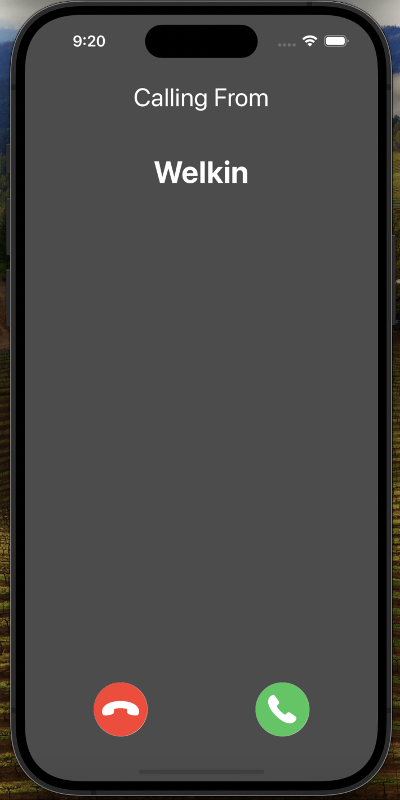

# RoomMate

Welcome to the official repository of RoomMate, an iOS app tailored for Duke student. RoomMate allows Duke students to quickly and accurately find their matching roommates. Please let me know if anything wrong with the server!

## Features

- **Duke Student Only:** This app is exclusively designed for Duke University students. Users must login with their Duke NetID to access the app’s features, ensuring a secure and student-specific environment.
- **Personalized Filter:** 
- **Video Calling:** The app includes a third-party video calling feature that allows students to easily connect with their potential future roommates.
- **Informational Blogs:** Some suggestions are here especially for students who are going to share housing for the first time.

## Getting Started

### Prerequisites

- Xcode 13 or later
- iPhone 15 Pro (If you're testing with simulator, please choose iPhone 15 Pro. However, if you want to test to video calling feature, you may want to test on your personal device, some UI layout may go weird if your device is of different type.)

### Installation & Running:

1. **Clone the repository:**

   ```bash
   git clone git@gitlab.oit.duke.edu:spring2024/roommate.git
   ```

2. **Navigate to the project directory:**

   ```bash
   cd roommate
   ```

3. **Open the project with XCode**

4. **Run the app with simulators or directly run on your personal device**

## User Guide

### Login with your prestigious Duke NetID

The password is the same as you set in the previous ECE564 homework.


### Editing your personal profile for a greater chance of matching

Add some photos and interests to let others know you better! Higher percentage of profile completeness would lead to more accurate matching from others!


### Swipe & Match!

Swipe and apply to people you're interested in to make friends.


### See who is interested in you

You could see people who're interested in you here and decide whether to accept.


### Call him/her to make sure that is the right one

You could call your friends here!  



### Get some suggestions before going to rent

"There are known knowns; these are things we know we know. We know there are known unknowns; that is to say, we know there are some things we do not know. But there are also unknown unknowns—the ones we don't know we don't know."


## Attribution

- RangeSlider.swift

  This range slider component is realized by following the guide of this video:

  [SwiftUI: Double Range Slider with Animation - YouTube](https://www.youtube.com/watch?v=ZKm98sKxBRM)